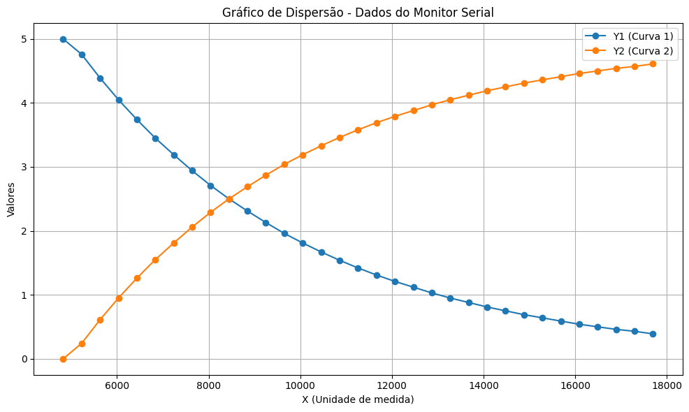

# Projeto: Análise de Circuito RC com Arduino

## 1. Introdução
Este projeto analisa o comportamento de um circuito RC (Resistor–Capacitor) usando **Arduino** para aquisição e **Python/Matplotlib** para visualização. O foco é observar a variação das tensões no resistor e no capacitor ao longo do tempo, durante o processo de carga.

---

## 2. Objetivos
- Medir tensões em um circuito RC por meio do Arduino.
- Enviar as leituras pela Serial e visualizá-las em gráfico.
- Registrar e interpretar o comportamento dinâmico do circuito.

---

## 3. Componentes Utilizados
| Componente | Quantidade | Finalidade |
|-----------|------------|------------|
| Arduino (compatível) | 1 | Aquisição e envio dos dados pela Serial |
| Resistor | 1 | Controle de corrente |
| Capacitor | 1 | Armazenamento de carga |
| Protoboard e jumpers | — | Montagem |
| Computador | 1 | Execução do Arduino IDE e scripts Python |

---

## 4. Metodologia (resumo)
- Montagem do circuito RC em série.
- Leitura analógica periódica pelo Arduino.
- Cálculo das tensões “no resistor” e “no capacitor” (complementares em relação a 5V).
- Envio dos dados via Serial no formato: `tempo_ms tensao_resistor tensao_capacitor`.
- Plot dos dados no Python/Matplotlib.

---

## 5. Códigos Utilizados

### 5.1 Arduino (`arduino.ino`)
```cpp
int pinoNoRC = 0; 
int valorLido = 0;
float tensaoCapacitor = 0, tensaoResistor;
unsigned long time; 

void setup() { 
  Serial.begin(9600); 
} 

void loop() { 
  time = millis(); 
  valorLido = analogRead(pinoNoRC); 
  tensaoResistor = (valorLido * 5.0 / 1023.0);
  tensaoCapacitor = abs(5.0 - tensaoResistor);

  Serial.print(time);      // tempo (ms)
  Serial.print(" "); 
  Serial.print(tensaoResistor);
  Serial.print(" ");
  Serial.println(tensaoCapacitor); 

  delay(400); 
}
```

### 5.2 Colab (`colab.py`)

```cpp
import matplotlib.pyplot as plt

# Dados do monitor serial (X, Y1, Y2)
dados = [
    (4825, 5.00, 0.00),
    (5227, 4.76, 0.24),
    (5629, 4.39, 0.61),
    (6032, 4.05, 0.95),
    (6433, 3.74, 1.26),
    (6836, 3.45, 1.55),
    (7238, 3.19, 1.81),
    (7641, 2.94, 2.06),
    (8043, 2.71, 2.29),
    (8444, 2.50, 2.50),
    (8847, 2.31, 2.69),
    (9249, 2.13, 2.87),
    (9652, 1.96, 3.04),
    (10054, 1.81, 3.19),
    (10457, 1.67, 3.33),
    (10858, 1.54, 3.46),
    (11260, 1.42, 3.58),
    (11663, 1.31, 3.69),
    (12065, 1.21, 3.79),
    (12468, 1.12, 3.88),
    (12870, 1.03, 3.97),
    (13273, 0.95, 4.05),
    (13675, 0.88, 4.12),
    (14077, 0.81, 4.19),
    (14480, 0.75, 4.25),
    (14881, 0.69, 4.31),
    (15284, 0.64, 4.36),
    (15686, 0.59, 4.41),
    (16089, 0.54, 4.46),
    (16491, 0.50, 4.50),
    (16893, 0.46, 4.54),
    (17296, 0.43, 4.57),
    (17698, 0.39, 4.61)
]

# Separando os dados
x = [item[0] for item in dados]
y1 = [item[1] for item in dados]
y2 = [item[2] for item in dados]

# Criando o gráfico
plt.figure(figsize=(10, 6))
plt.plot(x, y1, 'o-', label='Y1 (Curva 1)')
plt.plot(x, y2, 'o-', label='Y2 (Curva 2)')

# Configurando rótulos e título
plt.xlabel('X (Unidade de medida)')
plt.ylabel('Valores')
plt.title('Gráfico de Dispersão - Dados do Monitor Serial')
plt.legend()
plt.grid(True)
plt.tight_layout()
plt.show()

```

## 6. Resultados

Figura 1 — Curvas de tensão no resistor (Y1) e no capacitor (Y2) ao longo do tempo.


Observações:

- Y1 decresce enquanto Y2 cresce, evidenciando o comportamento complementar típico do circuito RC durante a carga.

- Em regime permanente, Y2 se aproxima da tensão da fonte e Y1 tende a 0 V.




## 7. Conclusão

O projeto demonstrou com sucesso a análise prática de um circuito RC utilizando Arduino e Python. A implementação permitiu visualizar claramente o comportamento característico do circuito, onde observamos:

- A relação inversa entre as tensões no resistor e capacitor
- O processo gradual de carga do capacitor
- A estabilização do sistema ao longo do tempo
- A precisão das medições através da aquisição digital

Esta abordagem experimental pode ser facilmente adaptada para outros tipos de análises de circuitos, servindo como base para futuros estudos e experimentos mais complexos na área de eletrônica.
